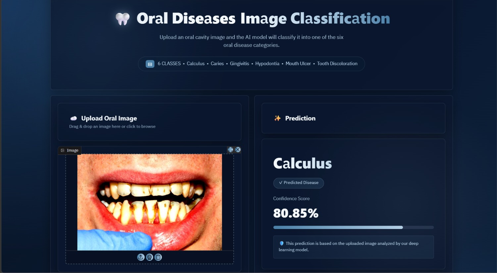
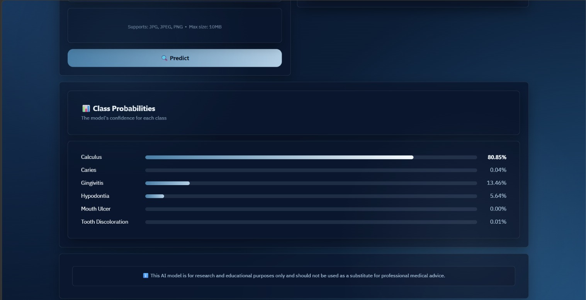

# 🦷 Oral Diseases Image Classification

<p align="center">
  
</p>

<p align="center">
Deep Learning web application for automatic oral disease classification using TensorFlow, Keras, ResNet50 and Gradio.
</p>

---

## 📌 Overview

This project is a deep learning-based web application that automatically classifies oral disease images into one of six categories using a trained ResNet50 model.

The application provides a clean user interface where users can upload an oral image and instantly receive:

- Predicted disease
- Confidence score
- Probability distribution for all classes

---

## ✨ Features

- Upload oral cavity images
- Automatic disease classification
- Confidence score
- Class probability visualization
- Modern Gradio interface
- Responsive dark theme
- Transfer Learning using ResNet50

---

## 📷 Application Preview

### Main Interface

<p align="center">

</p>

### Prediction Example

<p align="center">

</p>

---

## 📂 Dataset

The dataset contains six oral disease categories:

- Calculus
- Caries
- Gingivitis
- Hypodontia
- Mouth Ulcer
- Tooth Discoloration

---

## 🧠 Deep Learning Model

**Architecture**

- ResNet50
- Transfer Learning
- GlobalAveragePooling2D
- Dense Layer
- Dropout
- Softmax

**Training**

- TensorFlow
- Keras
- Adam Optimizer
- EarlyStopping
- ReduceLROnPlateau
- ModelCheckpoint
- Data Augmentation

---

## 📊 Model Performance

| Model | Test Accuracy |
|-------|--------------:|
| ResNet50 | **92.97%** |
| EfficientNetB0 | 92.05% |
| Custom CNN | 75.81% |

ResNet50 achieved the highest accuracy and was selected as the final deployment model.

---

## 🛠 Technologies

- Python
- TensorFlow
- Keras
- Gradio
- NumPy
- Pandas
- Pillow
- OpenCV

---

## 📁 Project Structure

```text
Oral-Diseases-Image-Classification
│
├── assets
│   ├── demo.png
│   └── interface.png
│
├── data
├── Notebook
├── app.py
├── style.css
├── best_model.keras
├── requirements.txt
└── README.md
```

---

## ⚙ Installation

```bash
git clone https://github.com/basmalakhaled20/Oral-Diseases-Image-Classification.git
```

```bash
cd Oral-Diseases-Image-Classification
```

```bash
pip install -r requirements.txt
```

---

## 🚀 Run

```bash
python app.py
```

Then open

```
http://127.0.0.1:7860
```

---

## 🔮 Future Work

- Support additional oral diseases
- Mobile optimization
- Cloud deployment
- Grad-CAM visualization
- Faster inference

---

## 👩‍💻 Author

**Basmala Khaled**

AI Engineer

GitHub:
https://github.com/basmalakhaled20